# Netflix Clone (UI only)

This is a frontend clone of Netflix I built during my internship — no backend, no real login, just a routing-based flow to mimic how the actual signup/browse experience feels.

Live: https://netflix-ui-by-areeba.vercel.app/

## Stack

Next.js (App Router), TypeScript, Tailwind CSS. Deployed on Vercel.

## What's in it

- Landing page with the usual dark Netflix hero + "Get Started" / "Sign In" buttons
- Sign in page
- Signup — split into two steps, and yes the background is white here on purpose (that's how it is in the original design too, different from the rest of the app)
- Profile selection screen, 4 profiles hardcoded
- Browse/home page with a hero banner and rows of movies you can scroll horizontally
- Bonus pages — TV Shows, Movies, New & Popular, My List — these basically reuse the Browse layout, just different data being passed in

## How the flow works

Since there's no backend, everything is just client-side routing pretending to be an auth flow:

## Screenshots

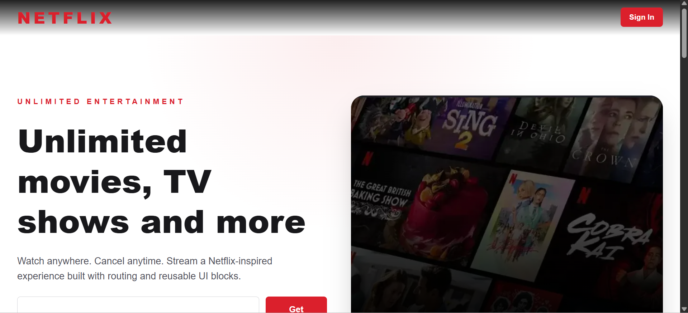
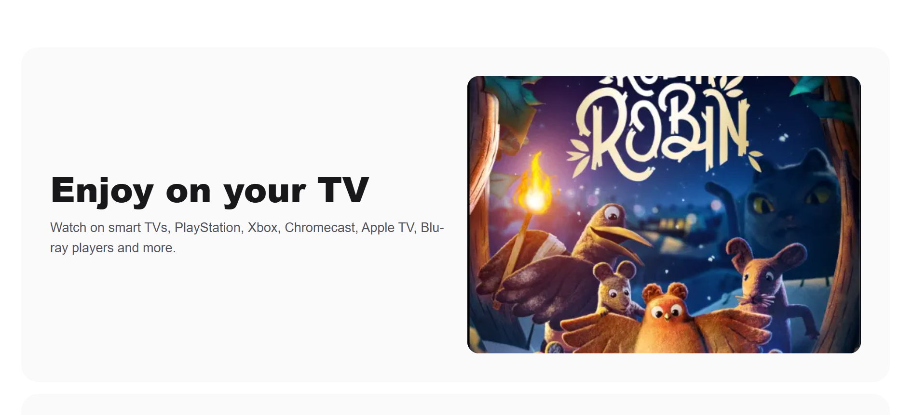
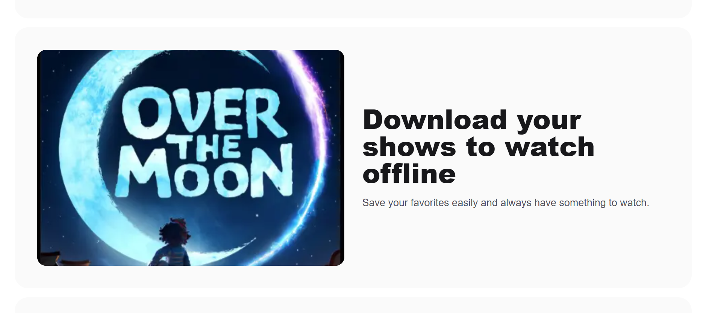
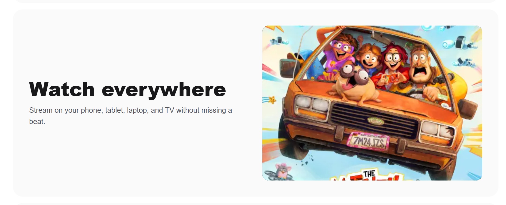
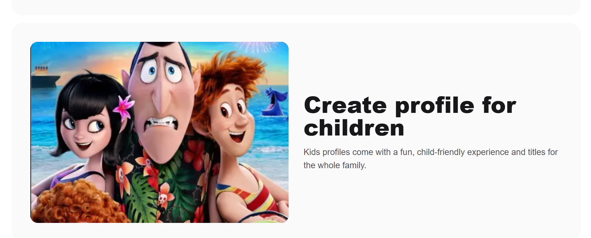
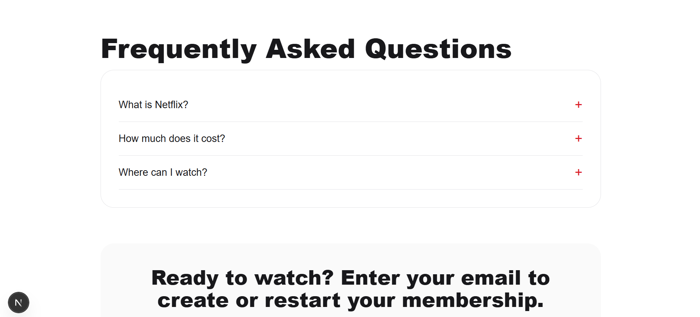
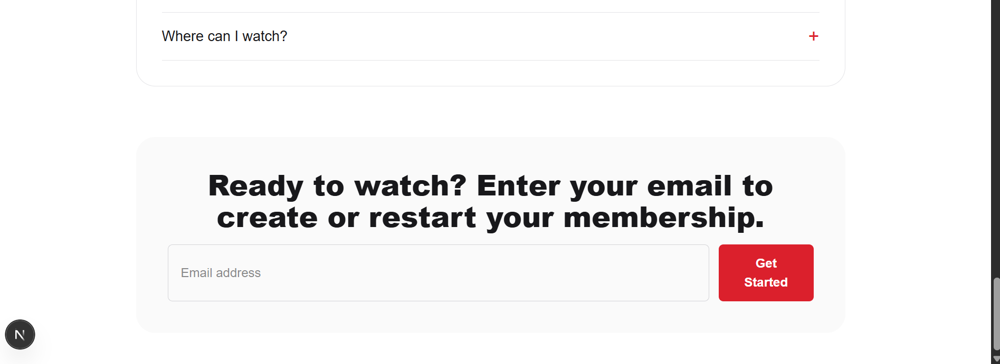
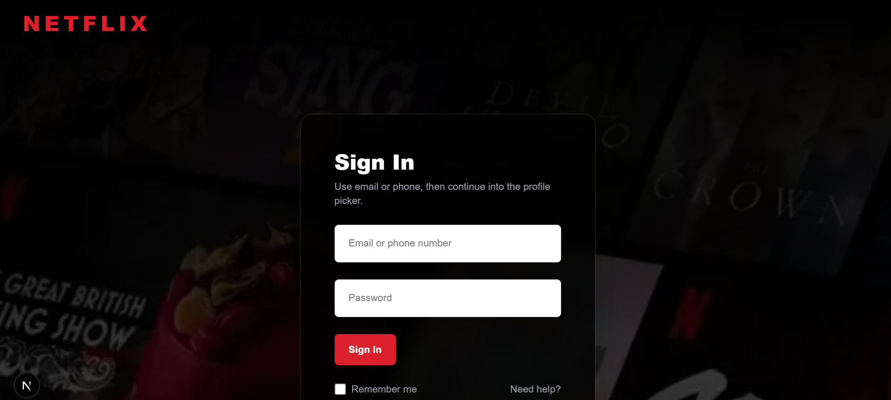
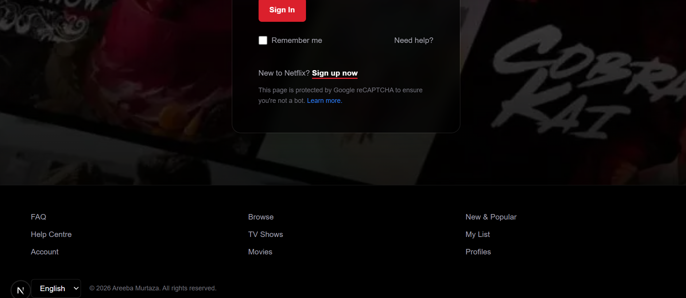
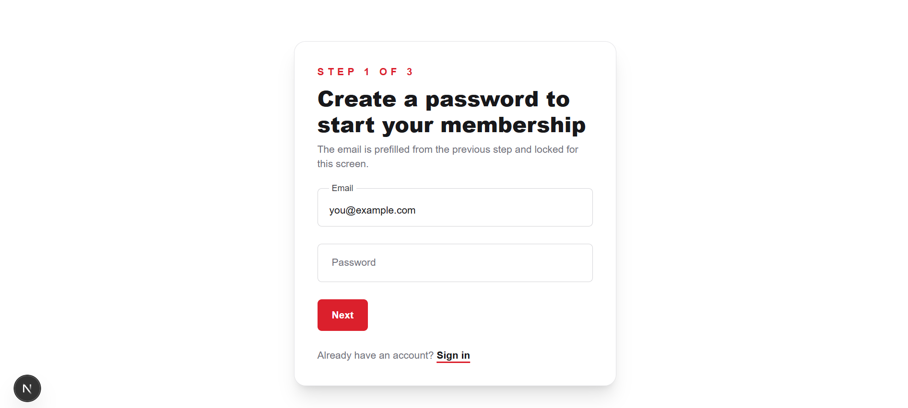
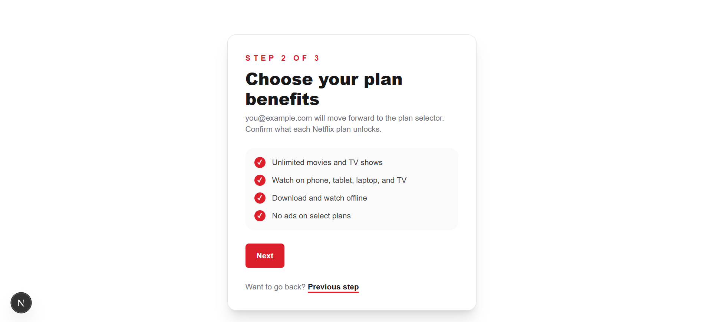
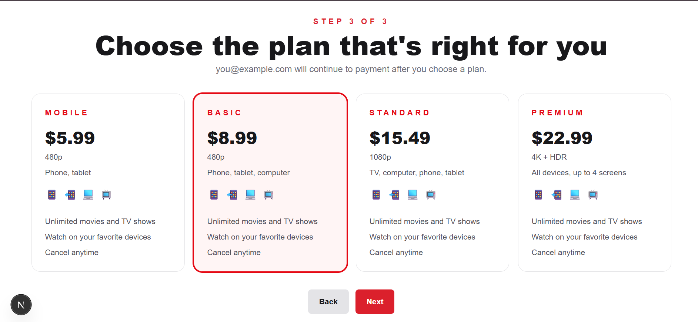
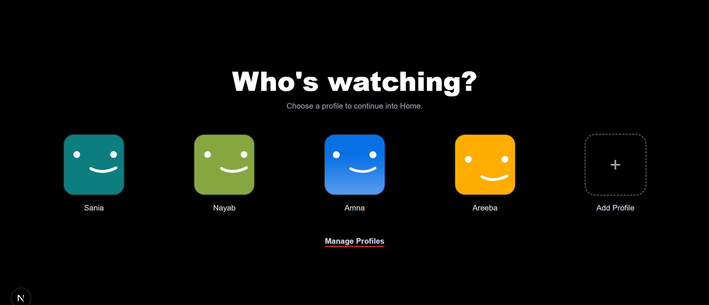
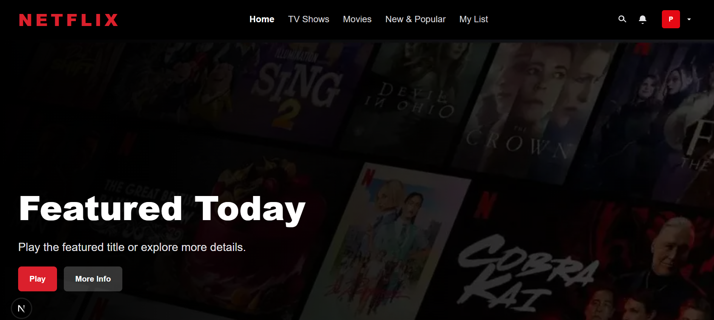
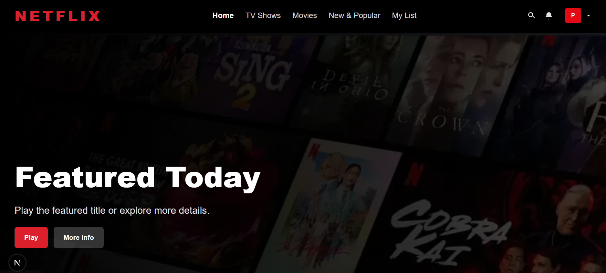
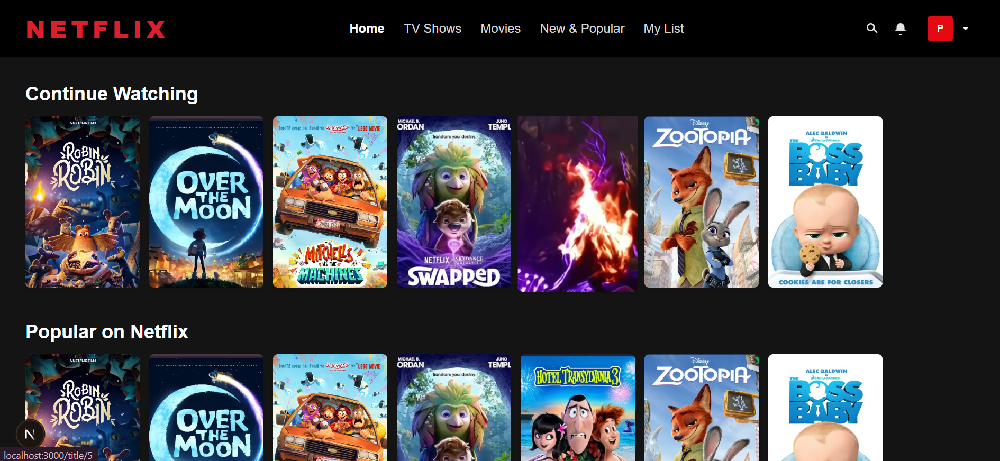
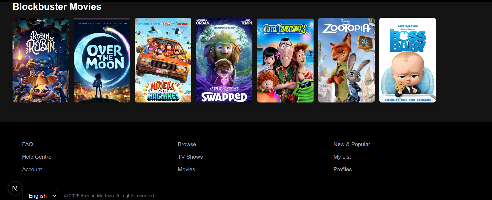
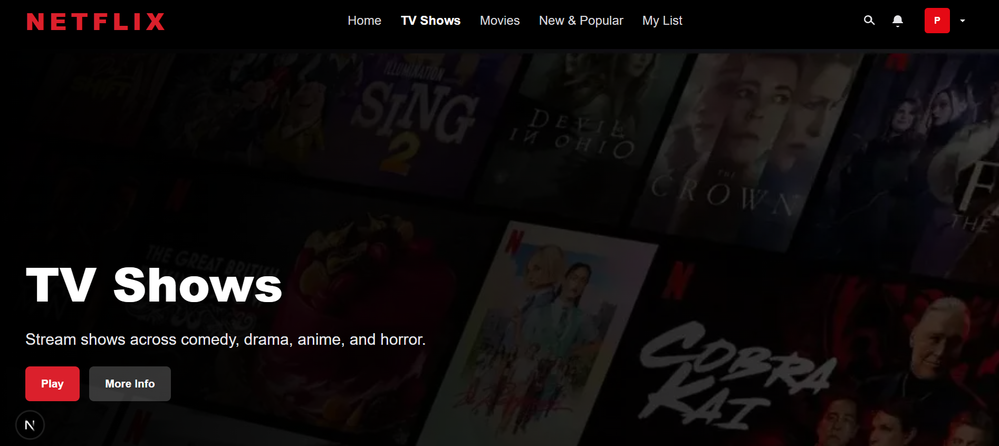
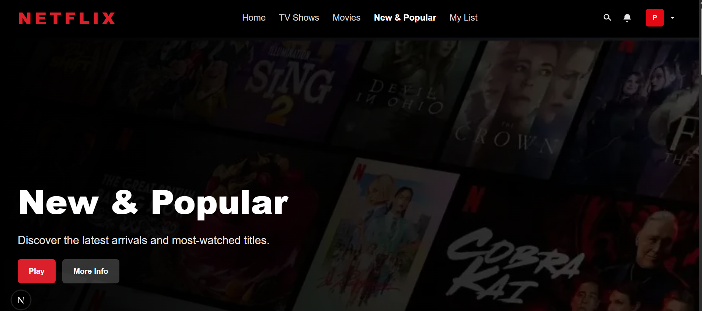
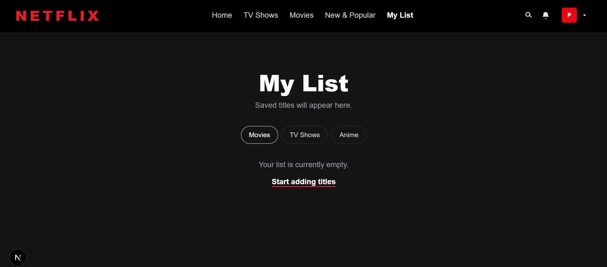
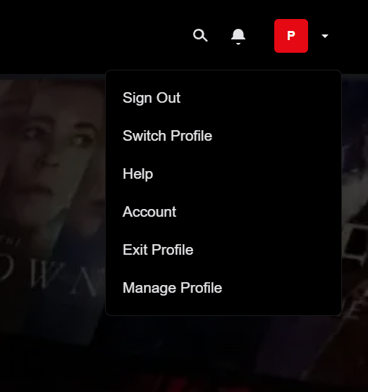
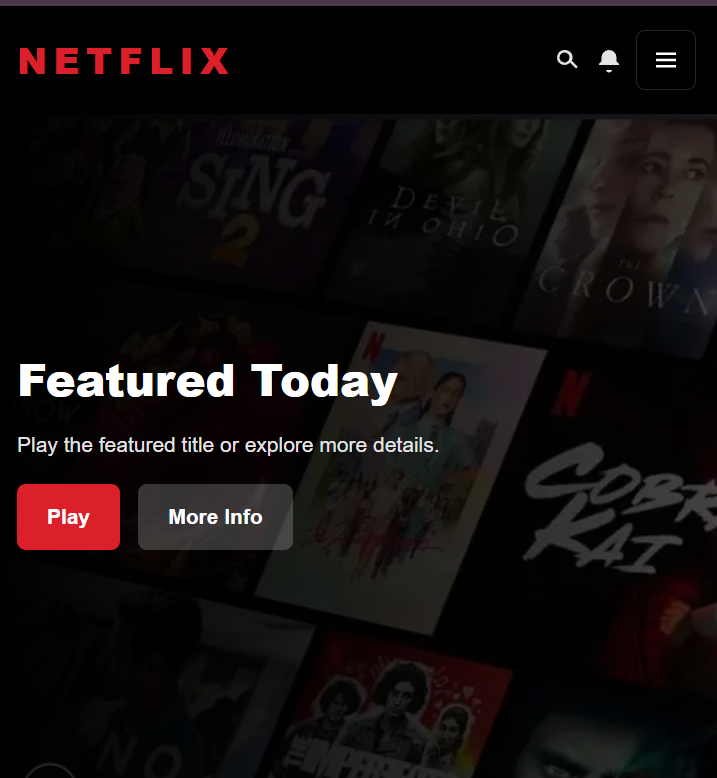